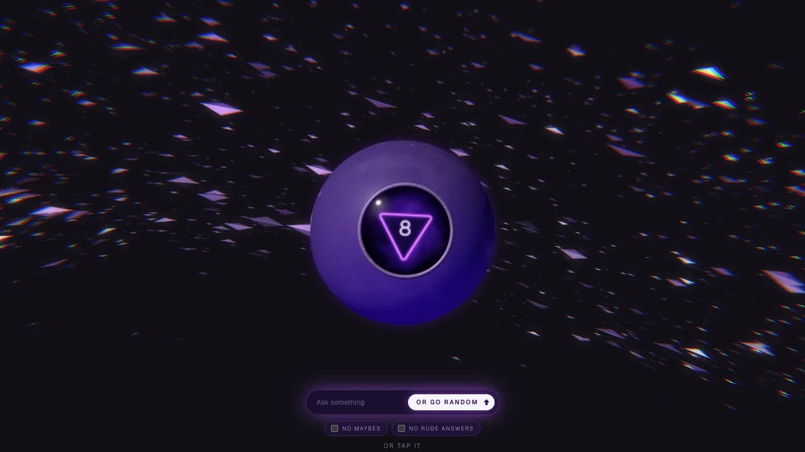

# Magic 8-Ball

An interactive Magic 8-Ball built with Next.js and three.js. Ask a question and
an answer rises out of the liquid, while the animated shard background reacts
to what the ball is doing.



## Features

- **Ask a question** — type it in the prompt bar, shake your phone (on
  supported devices) or tap the ball.
- **Smart answers** — Jev classifies your question and picks a fitting
  answer; an empty question gets a random one. If Jev can't be reached, the
  ball shows an error instead of answering. Without an `AI_GATEWAY_API_KEY`
  (or with one the gateway rejects), a warning shows in the prompt bar and
  only random answers are available.
- **Question log** — the current question floats above the ball, then the
  three most recent answers stay on screen for reference.
- **English, Spanish and Galician** — the language follows the browser's
  (and so the system's) language, falling back to English; each has its own
  URL (`/en`, `/es`, `/gl`). Texts live in `app/[lang]/dictionaries/`.
- **Installable** — add it to your home screen; it runs full-screen with an
  app icon and web app manifest.

## Tech stack

- [Next.js](https://nextjs.org/) 16 + React 19 + TypeScript
- [three.js](https://threejs.org/) via React Three Fiber and drei
- Tailwind CSS 4

## Getting started

### Prerequisites

- Node.js 20.9 or later
- [pnpm](https://pnpm.io/)

### Installation

```bash
git clone https://github.com/raulmouzo/magic-8.git
cd magic-8
pnpm install
```

### Environment variables

| Variable             | Required | Description                                                      |
| -------------------- | -------- | ---------------------------------------------------------------- |
| `AI_GATEWAY_API_KEY` | No       | Enables smart answers. Without it, only random answers are used. |

Put it in a `.env.local` file at the project root.

### Scripts

| Command      | Description                      |
| ------------ | -------------------------------- |
| `pnpm dev`   | Start the development server     |
| `pnpm build` | Build for production             |
| `pnpm start` | Serve the production build       |
| `pnpm lint`  | Run ESLint                       |

The app runs at [http://localhost:3000](http://localhost:3000).

## Credits

This project builds on the work of others:

- **Magic 8-Ball** — the ball started from
  [cywarr/Magic8Ball](https://github.com/cywarr/Magic8Ball), a three.js
  Magic 8-Ball, and was later redesigned. Released under the MIT License,
  Copyright (c) 2020 cywarr.
- **AeroShards background** — `components/aero-shards.tsx` comes from
  [React Bits](https://reactbits.dev/c/backgrounds/aero-shards) and has been
  modified here (a `pulse()` handle, eased speed changes and the side layout on
  narrow screens).
- **Fractal noise** — the GLSL `fbm` helper is from
  [yiwenl/glsl-fbm](https://github.com/yiwenl/glsl-fbm).
- **Triangle distance function** — adapted from Inigo Quilez's
  [2D distance functions](https://iquilezles.org/articles/distfunctions2d/) (MIT).
- **Procedural bump** — the screen-space normal perturbation follows three.js's
  bump-map shader chunk ([three.js](https://github.com/mrdoob/three.js), MIT).

The answers are the twenty classic Magic 8-Ball responses. "Magic 8 Ball" is a
trademark of Mattel; this project is not affiliated with or endorsed by Mattel.
